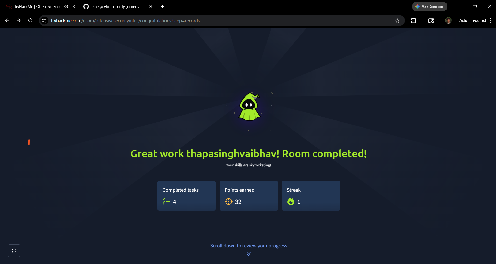
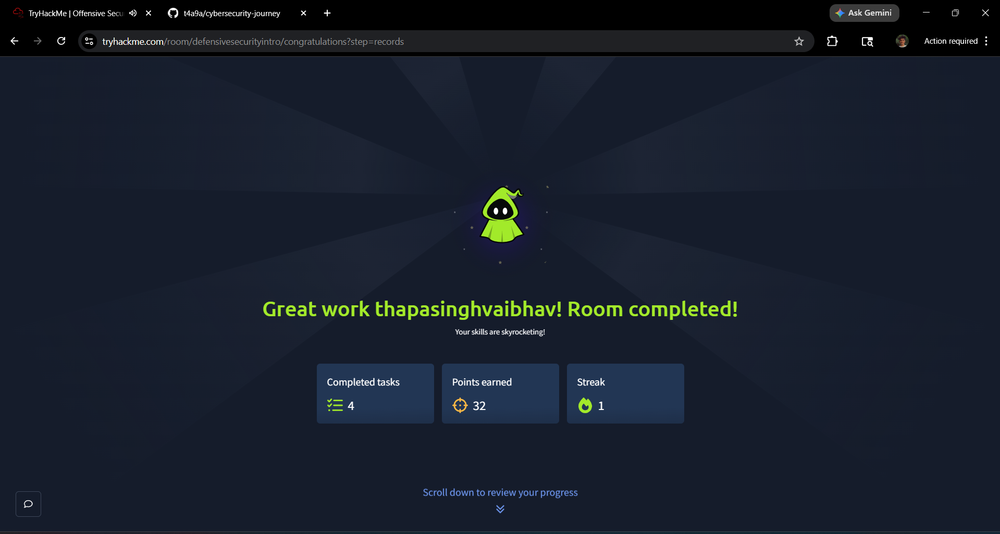

# Day 1 - Cybersecurity Journey

## Topics Covered:
- Introduction to Cyber Security
- Offensive Security
- Defensive Security

## What I Learned:
- Cybersecurity is about protecting systems, networks, and data
- Offensive security means attacking systems to find vulnerabilities
- Defensive security focuses on protecting and monitoring systems
- Ethical hackers work legally to identify weaknesses

## Practical Work:
- Completed Offensive Security Intro lab on TryHackMe
- Simulated hacking of a demo banking system (safe lab environment)
- Completed Defensive Security Intro lab
- Learned how defenders detect and prevent attacks

## Tools / Platform Used:
- TryHackMe

## Key Concepts:
- Offensive vs Defensive Security
- Hacker mindset
- Importance of legal and ethical hacking

## Key Takeaways:
- Always practice on legal platforms only
- Understanding both attack and defense is important
- Hands-on practice is necessary to learn cybersecurity

## Time Spent:
2–3 hours (approx)

## Difficulty:
Easy

## Confidence Level:
Basic understanding achieved

## Screenshots:

