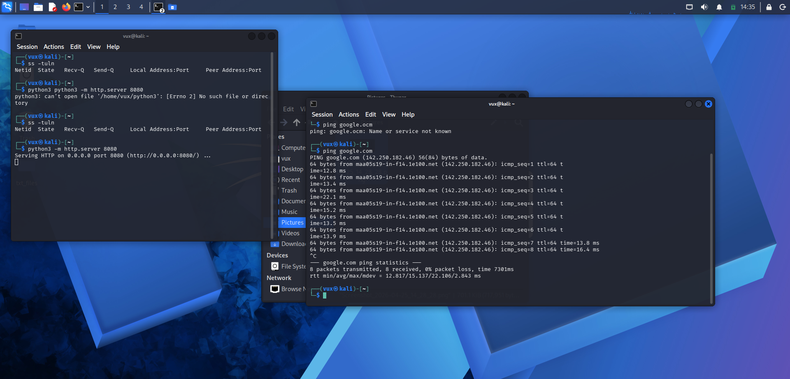
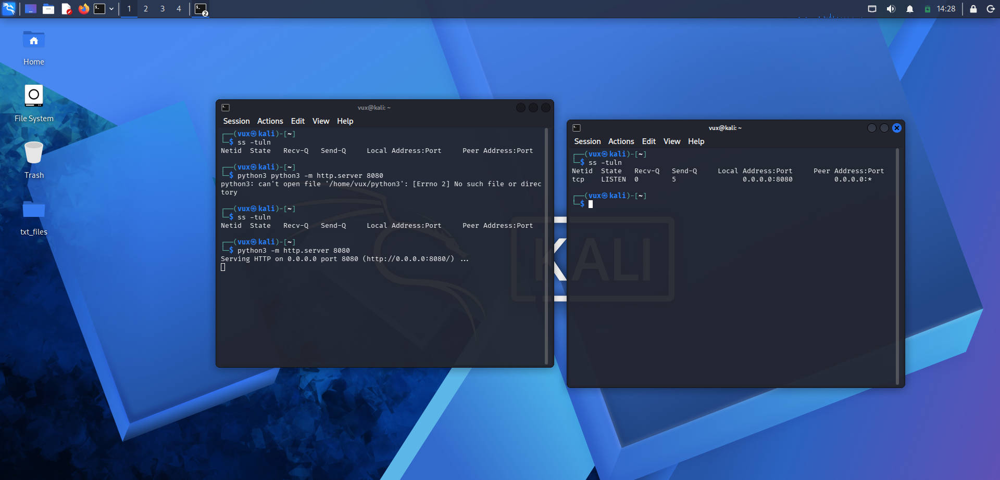

# 📅 Day 2 – Networking Basics (IP, Ports, Communication)

## 🎯 Objective

Understand how computers communicate using IP addresses, ports, and basic network commands.

---

## 🧠 1. IP Address

* IP address is the identity of a computer on a network
* It is like a phone number

### Example:

```
192.168.1.5
```

### Command:

```bash
ip a
```

### Purpose:

* Shows your system’s IP address
* Displays network interfaces (eth0 / wlan0)

---

## 🚪 2. Ports

* Ports are like doors of a computer
* Each port is used by a different service

### Common Ports:

* 80 → HTTP (website)
* 443 → HTTPS (secure website)
* 22 → SSH (remote login)

### Command:

```bash
ss -tuln
```

### Purpose:

* Shows open/listening ports
* Helps identify running services

---

## 🔄 3. Protocols

* Protocol = way computers communicate

### Types:

* TCP → reliable (connection-based)
* UDP → faster (no guarantee)

---

## 🌐 4. How Internet Works (Simple Flow)

1. User types a website (e.g., google.com)
2. DNS converts name → IP address
3. System connects to server
4. Request is sent (HTTP)
5. Server responds with data

---

## 🛠️ 5. Practical Commands

### Check IP:

```bash
ip a
```

### Test connectivity:

```bash
ping google.com
```

### Check open ports:

```bash
ss -tuln
```

---

## 🔥 6. Practical Exercise

Started a local server:

```bash
python3 -m http.server 8080
```

Checked open ports:

```bash
ss -tuln
```

### Result:

* Port 8080 was open
* Confirmed that services open ports

---

## 🧠 Key Learnings

* IP address identifies a system
* Ports are entry points for services
* Services must run to open ports
* Network communication follows request-response model

---

## ❌ Mistakes I Made

* Confused about ports initially
* Didn’t understand why no ports were open at first
* Needed practice to understand output of `ss -tuln`

---

## ✅ Outcome

* Understood basic networking concepts
* Learned how to check IP and ports
* Successfully opened and verified a port
* Built foundation for scanning tools




