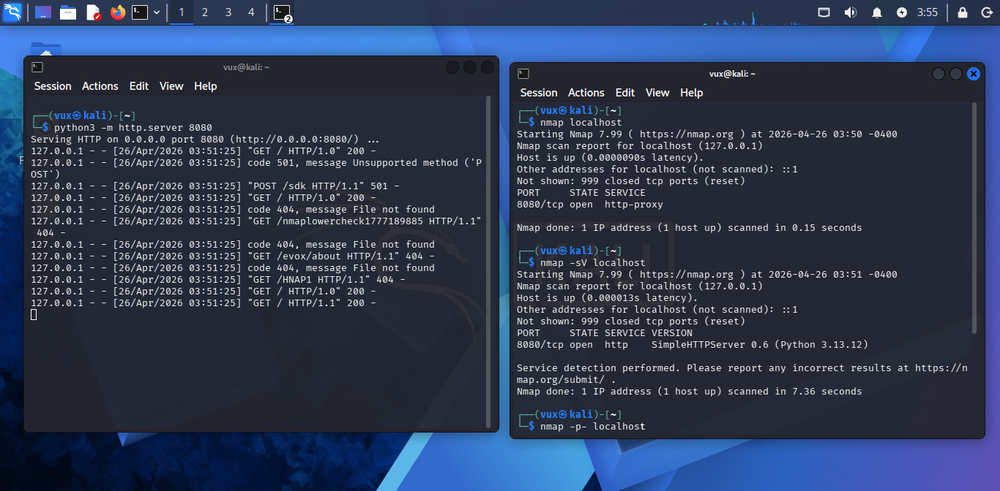
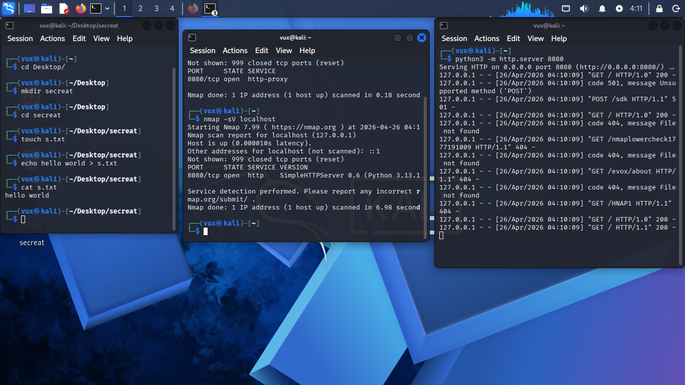
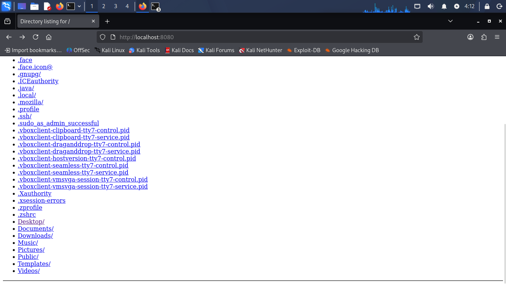
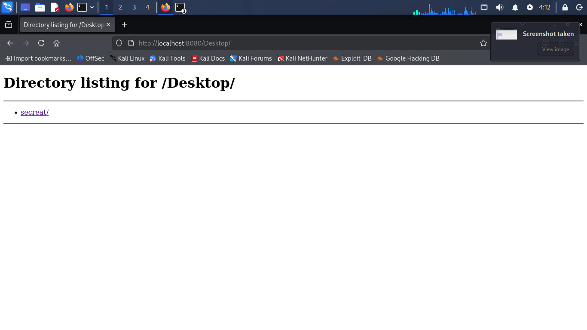
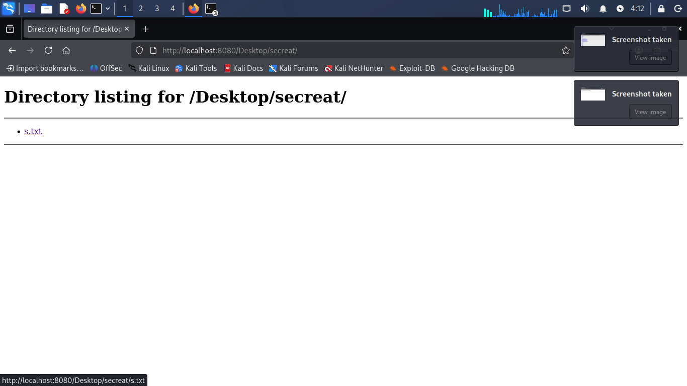
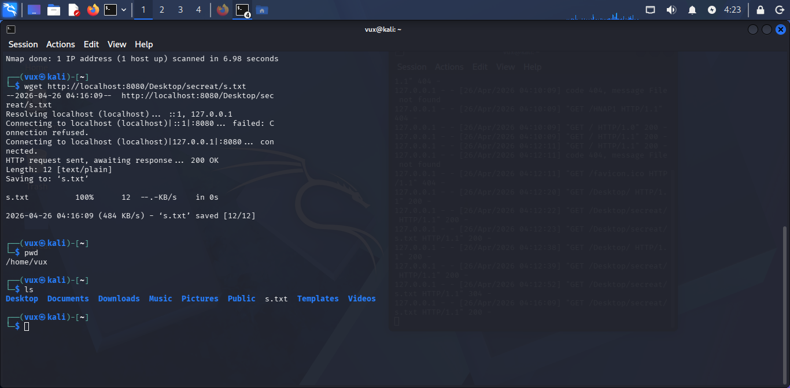

# 📅 Day 4 – Enumeration (Understanding What to Do After Scanning)

## 🎯 Objective

Learn how to analyze services after scanning and identify potential security risks.

---

## 🧠 1. What is Enumeration?

* Enumeration = collecting detailed information about a target
* It comes **after scanning**

### Example:

* Nmap shows → port 8080 open
* Enumeration asks → what is running on that port?

---

## 🔍 2. Enumeration Thinking

Instead of stopping at:

* “Port is open”

Ask:

* What service is running?
* Can I access it?
* What data is exposed?
* Is it vulnerable?

---

## 🌐 3. Web Enumeration (Practical)

Started a local web server:

```bash
python3 -m http.server 8080
```

Accessed in browser:

```
http://localhost:8080
```

---

## 📂 4. Directory Listing

Observed:

* Server showed files and folders
* Could navigate directories like:

  * `/Desktop/`
  * `/Desktop/secret/`

---

## 🔓 5. Sensitive File Exposure

Created a file:

```bash
echo "hello world" > s.txt
```

Accessed it via browser:

```
http://localhost:8080/Desktop/secret/s.txt
```

### Result:

* File was readable
* No authentication required

---

## ⬇️ 6. File Download Methods

### Method 1: Browser

* Click file → opens
* Right-click → Save As

### Method 2: Direct URL

* Open file URL
* Press `Ctrl + S`

### Method 3: Terminal

```bash
wget http://localhost:8080/Desktop/secret/s.txt
```

---

## 🚨 7. Vulnerability Identified

### Type:

**Information Disclosure**

### Reason:

* Directory listing enabled
* Files publicly accessible
* No authentication

---

## 🔥 8. Real World Risk

If this was a real server, attacker could access:

* Password files
* Configuration files
* Database backups

---

## 🧠 Key Learnings

* Scanning is only the first step
* Enumeration reveals real weaknesses
* Open services must be analyzed deeply
* Public file access can lead to data leaks

---

## ❌ Mistakes / Confusions

* Initially didn’t know how to download files
* Didn’t realize browser access = data exposure

---

## ✅ Outcome

* Understood enumeration process
* Identified exposed files
* Successfully accessed and downloaded data
* Learned real-world impact of misconfiguration

---











